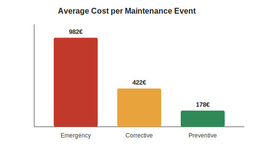
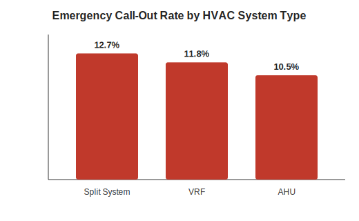
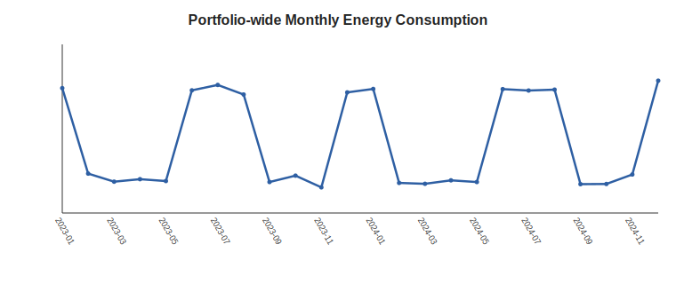
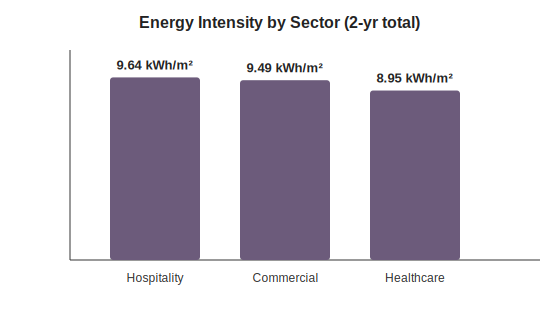

# HVAC Portfolio Maintenance & Energy Analytics

A SQL + Python analytics project exploring maintenance costs, reliability,
and energy consumption across a simulated portfolio of 24 commercial,
healthcare, and hospitality buildings — the kind of dataset a facilities
or asset-management team would track for HVAC systems (VRF, AHU, Split).

The dataset is synthetic (generated with a seeded random process) but
built to reflect realistic patterns from HVAC operations: preventive vs.
corrective vs. emergency maintenance cost ratios, seasonal energy demand,
and reliability differences across system types.

## Why this project

I spent 3+ years installing and maintaining HVAC systems (sheet metal and
fibreglass ductwork) across large commercial, healthcare, and hospitality
sites. This project applies that domain knowledge to a data-analytics
workflow: relational schema design, SQL aggregation queries, and
Python-based exploratory analysis — the same kind of questions a facilities
team would ask a BI dashboard.

## Stack
- **SQL (SQLite)** — schema design + analytical queries
- **Python** (pandas, matplotlib) — data generation, pipeline, and charts
- **Power BI** — the queries in `sql/analysis_queries.sql` map directly to
  a Power BI dashboard (visuals here are the Python-generated equivalents,
  built so the project runs end-to-end without external dependencies)

## Project structure
```
hvac-analytics/
├── data/                      synthetic CSV source data
│   ├── buildings.csv
│   ├── maintenance_logs.csv
│   └── energy_readings.csv
├── sql/
│   ├── schema.sql             table definitions
│   └── analysis_queries.sql   6 analysis queries
├── scripts/
│   ├── generate_data.py       builds the synthetic dataset
│   └── run_analysis.py        loads SQLite DB, runs queries, builds charts
└── charts/                    output visuals (PNG)
```

## Key findings

- **Emergency call-outs cost ~5.5x more than preventive maintenance**
  (€982 vs. €178 avg per event) and cause ~17x more downtime (8.8h vs. 0.5h)
  — the clearest ROI case for shifting spend toward preventive schedules.
- **Split Systems have the highest emergency rate** (12.7%), followed by
  VRF (11.8%) and AHU (10.5%) — consistent with AHU systems' more
  accessible, serviceable design.
- **Portfolio energy demand is strongly seasonal**, peaking ~35% above
  baseline in summer and winter months (heating/cooling load), which is
  a natural basis for demand-response or scheduling initiatives.
- **Hospitality buildings run the highest energy intensity** (9.64 kWh/m²)
  vs. Healthcare (8.95 kWh/m²), plausible given occupancy-driven HVAC use
  patterns in hotels vs. more schedule-driven clinical environments.

## Charts

| | |
|---|---|
|  |  |
|  |  |

## Running it yourself

```bash
pip install pandas numpy matplotlib
python scripts/generate_data.py     # (re)generates data/*.csv
python scripts/run_analysis.py      # builds hvac_analytics.db + charts/
```

## Next steps
- Load `data/*.csv` into Power BI Desktop directly to reproduce the same
  aggregates as interactive visuals with slicers by city/sector/system type
- Extend with a predictive layer (e.g. flag buildings at rising risk of
  an emergency call-out based on recent maintenance frequency)
